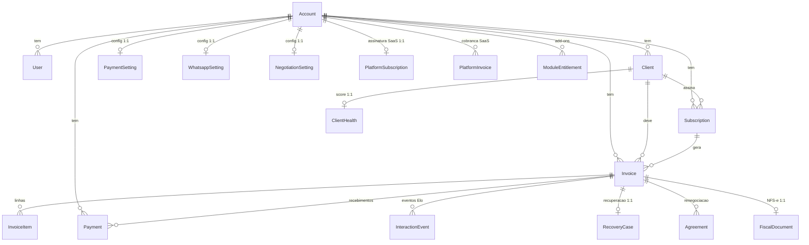

# Referência do Modelo de Dados — Adimplo

> Documento autodescritivo do banco da **Adimplo**, um SaaS multi-tenant de automação de cobrança. Público-alvo: dev novo (ou fundador) que precisa entender o banco sem abrir o `schema.prisma`. Gerado a partir do schema; mantenha em sincronia ao alterar migrations.

## Introdução

- **Banco**: PostgreSQL.
- **ORM**: Prisma (`prisma-client-js`), `DATABASE_URL` via env.
- **Multi-tenant**: todo dado de negócio pertence a um **`Account`** (o *tenant*, uma empresa cliente da Adimplo). A ligação é feita pelo campo **`tenantId`**, que é FK para `Account.id`.
- **Convenção de cascata**: quase toda tabela de negócio tem `tenantId String` + `account Account @relation(fields: [tenantId], references: [id], onDelete: Cascade)`. Ou seja, **apagar um `Account` apaga em cascata todos os dados daquele tenant**. As poucas exceções (tabelas globais/de plataforma) estão marcadas abaixo.
- **Tabelas 1:1 com Account** (as `*Setting` e afins) usam `tenantId String @unique`.
- **IDs**: `String @id @default(uuid())` (UUID v4) na maioria dos models.
- **Datas**: `createdAt DateTime @default(now())`; `lastUpdate DateTime @updatedAt` onde há mutação frequente.
- **Segredos**: campos de credencial (`credentialsEnc`, `apiKey`, `webhookSecret`, `token`) são cifrados em repouso com **AES-256-GCM** (prefixo `enc:v1:`) ou guardados como hash — marcado caso a caso.
- **RBAC** (spec 0054): `User.role` ∈ `OWNER`/`ADMIN`/`MEMBER`. Ações de gestão (credenciais, plano, integração IoT, excluir cliente) exigem OWNER/ADMIN.

---

## Diagrama ER — visão geral (núcleo)

*(O diagrama mostra só o núcleo; as ~30 tabelas restantes seguem o mesmo padrão de `1:1`/`1:N` com `Account` e/ou `Client`/`Invoice`, detalhadas abaixo.)*

---

## 1. Núcleo / Tenancy

### `Account` — tabela `Account`
Conta/tenant do SaaS. Raiz de toda a árvore de dados; todo negócio pendura aqui.

| campo | tipo | descrição |
|---|---|---|
| `id` | String | **PK** (UUID). |
| `name` | String | Nome da empresa/tenant. |
| `status` | String | Estado do tenant. Default `ACTIVE`. Valores: `ACTIVE`, `SUSPENDED`. |
| `createdAt` | DateTime | Criação. Default `now()`. |
| `acceptedTermsAt` | DateTime? | Prova de aceite dos Termos/Política no cadastro (LGPD, spec 0022). |
| `acceptedTermsVersion` | String? | Versão dos termos aceitos. |

**Relacionamentos (1:N)**: `clients`, `invoices`, `users`, `subscriptions`, `payments`, `interactionEvents`, `agreements`, `platformInvoices`, `recoveryCases`, `recoveryAttempts`, `clientHealth`, `cancellationRequests`, `contractAcceptances`, `accessEvents`, `offerProducts`, `offerPurchases`, `winbackCases`, `referrals`, `fiscalDocuments`, `moduleEntitlements`.
**Relacionamentos (1:1)**: `paymentSetting`, `whatsappSetting`, `negotiationSetting`, `platformSubscription`, `onboardingState`, `reguaSetting`, `channelSetting`, `retentionSetting`, `contractSetting`, `accessSetting`, `accessIntegration`, `winbackSetting`, `referralSetting`, `fiscalSetting`, `brandSetting`.

### `User` — tabela `User`
Usuário do painel de um tenant (dono/operador da empresa).

| campo | tipo | descrição |
|---|---|---|
| `id` | String | **PK** (UUID). |
| `email` | String | Login. **@unique** (global). |
| `passwordHash` | String | Senha (bcrypt). |
| `name` | String | Nome do usuário. |
| `role` | String | Papel: `OWNER` \| `ADMIN` \| `MEMBER`. Default `OWNER`. |
| `createdAt` | DateTime | Criação. |
| `tenantId` | String | **FK → Account** (`onDelete: Cascade`). |

**Índice**: `@@index([tenantId])`. **N:1** com `Account`. O nº de usuários por tenant é limitado por `maxSeats` do plano (spec 0053).

### `PlatformAdmin` — tabela `PlatformAdmin`
Administrador da **plataforma** (staff da Adimplo). **Separado de `User`/`Account`** — sem `tenantId`. Criado por script, nunca por auto-cadastro. **Tabela global**.

| campo | tipo | descrição |
|---|---|---|
| `id` | String | **PK** (UUID). |
| `email` | String | Login. **@unique**. |
| `name` | String | Nome. |
| `passwordHash` | String | Senha (bcrypt). |
| `role` | String | `SUPERADMIN` \| `SUPPORT`. Default `SUPERADMIN`. |
| `createdAt` / `lastUpdate` | DateTime | Timestamps. |

### `WebhookEvent` — tabela `WebhookEvent`
Idempotência de webhooks (spec 0003): registra ids de evento já processados para não processar duas vezes. **Tabela global**.

| campo | tipo | descrição |
|---|---|---|
| `id` | String | **PK** = event id do provedor (idempotency key). |
| `provider` | String | Provedor que emitiu o evento. |
| `receivedAt` | DateTime | Recebimento. Default `now()`. |

---

## 2. Cobrança & Pagamento

### `Client` — tabela `Client`
O pagador/cliente de um tenant — quem recebe as cobranças.

| campo | tipo | descrição |
|---|---|---|
| `id` | String | **PK** (UUID). |
| `name` | String | Nome. |
| `phone` | String | Telefone (canal WhatsApp). |
| `document` | String | CPF/CNPJ. |
| `email` | String? | E-mail (canal opcional, spec 0032). |
| `status` | String | Situação. Default `EM_DIA`. |
| `debtValue` | Decimal(12,2) | Dívida acumulada. Default `0`. |
| `processed` | Boolean | Flag de processamento (worker). Default `false`. |
| `portalToken` | String? | **@unique**. Token público do Portal do pagador (spec 0027). |
| `anonymizedAt` | DateTime? | LGPD: quando o titular foi anonimizado. |
| `accessOverride` | String? | Liga/Desliga Acesso (0042): `null`\|`allow`\|`block`. |
| `accessState` | String? | Último estado propagado (0043): `allowed`\|`grace`\|`blocked`. |
| `referralCode` | String? | **@unique**. Código público de indicação (0046). |
| `referredByClientId` | String? | Quem indicou este cliente. |
| `referralCreditCents` | Int | Crédito de indicação (centavos) p/ abater na próxima fatura. Default `0`. |
| `createdAt` / `lastUpdate` | DateTime | Timestamps. |
| `tenantId` | String | **FK → Account** (`Cascade`). |

**Constraints**: `@@unique([tenantId, phone])`. **Índices**: `@@index([status])`, `@@index([tenantId, status])`.

### `Invoice` — tabela `Invoice`
Uma fatura/cobrança de um cliente. Objeto central da operação.

| campo | tipo | descrição |
|---|---|---|
| `id` | String | **PK** (UUID). |
| `value` | Decimal(12,2) | Valor total. |
| `status` | String | Default `PENDING`. Valores: `PENDING`, `PAID`, `OVERDUE`, `FAILED`, `RENEGOTIATED`, `CANCELED`. |
| `pixCopyPaste` / `pixQrCode` | String? | PIX gerado pelo gateway. |
| `checkoutUrl` | String? | URL de checkout hospedado. |
| `gatewayId` | String? | **@unique**. Localizador no gateway (casa o webhook; global entre tenants). |
| `linkToken` | String? | **@unique**. Token do link próprio do Adimplo (`/r/:token` — Elo, 0016). |
| `dueDate` | DateTime | Vencimento. |
| `paidAt` | DateTime? | Confirmação do pagamento. |
| `notificationSent` | Boolean | Notificação inicial enviada. Default `false`. |
| `reminderStep` | Int | Régua (0026): passos enviados. Default `0`. |
| `lastReminderAt` | DateTime? | Último lembrete. |
| `clientId` | String | **FK → Client** (`Cascade`). |
| `tenantId` | String | **FK → Account** (`Cascade`). |
| `subscriptionId` | String? | **FK → Subscription** (`SetNull`) — origem recorrente. |
| `period` | String? | Competência `YYYY-MM` (faturas recorrentes). |

**Constraints**: `@@unique([subscriptionId, period])` (idempotência: 1 fatura por assinatura/mês).
**Índices**: `@@index([clientId])`, `@@index([status])`, `@@index([status, clientId])`, `@@index([tenantId, status])`, `@@index([tenantId, clientId])`, `@@index([tenantId, status, dueDate])`.

### `InvoiceItem` — tabela `InvoiceItem`
Linha de uma fatura (0007). Total da fatura = soma de `quantity * unitPrice`.

| campo | tipo | descrição |
|---|---|---|
| `id` | String | **PK** (UUID). |
| `description` | String | Produto/serviço. |
| `quantity` | Int | Quantidade. Default `1`. |
| `unitPrice` | Decimal(12,2) | Preço unitário (pode ser negativo — ex.: crédito de indicação). |
| `invoiceId` | String | **FK → Invoice** (`Cascade`). |

**Índice**: `@@index([invoiceId])`.

### `Payment` — tabela `Payment`
Recebimento de uma fatura (0015). Fonte **única** do "dinheiro que entrou": nasce do gateway (webhook) **ou** de baixa manual.

| campo | tipo | descrição |
|---|---|---|
| `id` | String | **PK** (UUID). |
| `amount` | Decimal(12,2) | Valor recebido. |
| `method` | String? | `pix`\|`dinheiro`\|`transferencia`\|`cartao`\|`boleto`\|`outro`. |
| `source` | String | `manual` \| `gateway`. |
| `paidAt` | DateTime | Data do recebimento. |
| `note` / `receiptUrl` | String? | Observação / comprovante. |
| `invoiceId` | String | **FK → Invoice** (`Cascade`). |
| `tenantId` | String | **FK → Account** (`Cascade`). |

**Índices**: `@@index([invoiceId])`, `@@index([tenantId])`, `@@index([tenantId, paidAt])`.

---

## 3. Recorrência

### `Subscription` — tabela `Subscription`
Assinatura/mensalidade recorrente (0009). "Molde" que, a cada competência, gera uma `Invoice`.

| campo | tipo | descrição |
|---|---|---|
| `id` | String | **PK** (UUID). |
| `description` | String | O que é cobrado (vira o item da fatura). |
| `amount` | Decimal(12,2) | Valor mensal. |
| `dayOfMonth` | Int | Dia de vencimento (1..28). Default `10`. |
| `status` | String | `ACTIVE`\|`PAUSED`\|`CANCELED`. Default `ACTIVE`. |
| `startDate` | DateTime | Início. Default `now()`. |
| `nextRunDate` | DateTime | Quando gerar a próxima fatura. |
| `discountPercent` | Int? | Desconto de retenção ativo (0..100, 0038). |
| `discountUntil` | DateTime? | Validade do desconto. |
| `clientId` | String | **FK → Client** (`Cascade`). |
| `tenantId` | String | **FK → Account** (`Cascade`). |

**Índices**: `@@index([clientId])`, `@@index([tenantId, status])`, `@@index([status, nextRunDate])`.

---

## 4. Elo & Interação (comportamento do pagador + autonegociação)

### `InteractionEvent` — tabela `InteractionEvent`
Evento do ciclo de vida da cobrança (0016 — "Elo"). Fonte **única e append-only** do comportamento do pagador (substância da autonegociação, Cockpit e Score).

| campo | tipo | descrição |
|---|---|---|
| `id` | String | **PK** (UUID). |
| `type` | String | `link_created`\|`sent`\|`delivered`\|`read`\|`failed`\|`open`\|`pay_attempt`\|`paid`. |
| `channel` | String? | `whatsapp`\|`sms`\|`email`\|`web`. |
| `metadata` | Json? | `{ ua?, ipHash?, providerMessageId? }` — **sem IP cru / PII**. |
| `occurredAt` | DateTime | Quando ocorreu. |
| `invoiceId` | String? | **FK → Invoice** (`Cascade`). |
| `clientId` | String? | **FK → Client** (`SetNull`). |
| `tenantId` | String | **FK → Account** (`Cascade`). |

**Índices**: `@@index([invoiceId])`, `@@index([invoiceId, type])`, `@@index([tenantId, occurredAt])`.

### `NegotiationSetting` — tabela `NegotiationSetting`
Regras de **autonegociação** por tenant (0018 — "Botão de Alívio"). Tetos do que o Adimplo pode oferecer sozinho. **1:1 com Account.**

| campo | tipo | descrição |
|---|---|---|
| `id` | String | **PK** (UUID). |
| `enabled` | Boolean | Liga o alívio. Default `false`. |
| `hesitationOpens` | Int | Aberturas p/ acionar. Default `3`. |
| `discountEnabled` | Boolean | Permite desconto. Default `false`. |
| `discountPercent` | Decimal(5,4) | Teto 0..1 (ex.: `0.1000`). |
| `installmentsEnabled` / `maxInstallments` | Boolean / Int | Parcelamento + teto. |
| `deferEnabled` / `deferMaxDays` / `deferFeePercent` | Boolean / Int / Decimal(5,4) | Adiamento + tetos. |
| `tenantId` | String | **FK → Account @unique**. |

### `Agreement` — tabela `Agreement`
Acordo de autonegociação (0018). Gera **nova** cobrança e "supersede" a original (→ `RENEGOTIATED`). `terms` guarda o **snapshot** dos valores aplicados.

| campo | tipo | descrição |
|---|---|---|
| `id` | String | **PK** (UUID). |
| `type` | String | `discount`\|`installments`\|`defer`. |
| `status` | String | `PENDING`\|`ACCEPTED`\|`CANCELLED`\|`EXPIRED`. Default `PENDING`. |
| `terms` | Json | `{ originalValue, finalValue, discountPercent?, installments?, newDueDate?, feePercent? }`. |
| `originalInvoiceId` | String | **FK → Invoice** (`AgreementOriginal`, `Cascade`). |
| `newInvoiceId` | String? | **FK → Invoice @unique** (`AgreementNew`, `SetNull`). |
| `tenantId` | String | **FK → Account** (`Cascade`). |

**Índices**: `@@index([originalInvoiceId])`, `@@index([tenantId])`, `@@index([originalInvoiceId, status])`.

---

## 5. Recuperação & Retenção

### `RecoveryCase` — tabela `RecoveryCase`
Caso de recuperação de pagamento falho (0033 — F1). Orbita **uma** fatura vencida.

| campo | tipo | descrição |
|---|---|---|
| `id` | String | **PK** (UUID). |
| `reason` | String | `overdue`\|`payment_failed`\|`pix_unpaid`\|`card_expired`. Default `overdue`. |
| `status` | String | `open`\|`recovering`\|`recovered`\|`lost`\|`cancelled`. Default `open`. |
| `amountAtRisk` | Decimal(12,2) | Valor em risco. |
| `currentStep` | Int | Passo da sequência. Default `0`. |
| `lastChannel` | String? | `whatsapp`\|`email`. |
| `reliefOffered` | Boolean | Já ofertou alívio. Default `false`. |
| `nextActionAt` | DateTime? | Próxima ação devida. |
| `openedAt` / `resolvedAt` | DateTime? | Abertura / resolução. |
| `outcome` | String? | `paid`\|`agreement`\|`sem_resposta`\|`cancelado_pelo_dono`. |
| `invoiceId` | String | **FK → Invoice @unique** (`Cascade`) — 1 caso por fatura. |
| `clientId` | String | **FK → Client** (`Cascade`). |
| `tenantId` | String | **FK → Account** (`Cascade`). |

**Índices**: `@@index([tenantId, status, nextActionAt])`, `@@index([tenantId, status])`.

### `RecoveryAttempt` — tabela `RecoveryAttempt`
Cada ação num caso de recuperação (auditoria).

| campo | tipo | descrição |
|---|---|---|
| `id` | String | **PK** (UUID). |
| `step` | Int | Passo. |
| `channel` | String? | `whatsapp`\|`email`. |
| `action` | String | `remind`\|`switch_channel`\|`offer_relief`. |
| `result` | String? | `sent`\|`failed`\|`opened`\|`paid`. |
| `caseId` | String | **FK → RecoveryCase** (`Cascade`). |
| `tenantId` | String | **FK → Account** (`Cascade`). |

**Índice**: `@@index([tenantId, caseId])`.

### `ClientHealth` — tabela `ClientHealth`
Radar de Risco (0035 — F2). Score/saúde do cliente. **1:1 com Client.**

| campo | tipo | descrição |
|---|---|---|
| `id` | String | **PK** (UUID). |
| `score` | Int | 0..100 (100 = saudável). |
| `band` | String | `healthy`\|`watch`\|`at_risk`. |
| `signals` | Json | Explicabilidade (avgDaysLate, trendUp, missedRecurring, …). |
| `computedAt` | DateTime | Cálculo. Default `now()`. |
| `clientId` | String | **FK → Client @unique** (`Cascade`). |
| `tenantId` | String | **FK → Account** (`Cascade`). |

**Índice**: `@@index([tenantId, band])`.

### `CancellationRequest` — tabela `CancellationRequest`
Segura Quem Quer Sair (0037 — F11). Pedido de cancelamento + desfecho de retenção.

| campo | tipo | descrição |
|---|---|---|
| `id` | String | **PK** (UUID). |
| `reason` | String? | `preco`\|`nao_uso`\|`mudanca`\|`insatisfacao`\|`outro`. |
| `status` | String | `open`\|`saved`\|`cancelled`. Default `open`. |
| `recommended` / `saveOffer` | String? | Oferta recomendada / aplicada. |
| `appliedPercent` / `appliedUntil` | Int? / DateTime? | Desconto aplicado + validade. |
| `clientId` | String | **FK → Client** (`Cascade`). |
| `subscriptionId` | String | FK p/ Subscription. |
| `tenantId` | String | **FK → Account** (`Cascade`). |

**Índice**: `@@index([tenantId, status])`.

### `WinbackCase` — tabela `WinbackCase`
Caso de winback: 1 por assinatura cancelada (0045, F5).

| campo | tipo | descrição |
|---|---|---|
| `id` | String | **PK** (UUID). |
| `status` | String | `pending`\|`sending`\|`sent`\|`skipped`. Default `pending`. |
| `eligibleAt` | DateTime | Quando virou elegível. |
| `sentAt` | DateTime? | Envio da oferta. |
| `subscriptionId` | String | **FK → Subscription @unique** (`Cascade`). |
| `invoiceId` | String? | **FK → Invoice @unique** (`SetNull`) — fatura da oferta. |
| `clientId` | String | **FK → Client** (`Cascade`). |
| `tenantId` | String | **FK → Account** (`Cascade`). |

**Índice**: `@@index([tenantId, status])`. *(O estado `sending` é o claim atômico anti-cobrança-dupla — spec 0054.)*

---

## 6. Configurações por tenant (`*Setting`)

Todas 1:1 com `Account` (`tenantId @unique`, `onDelete: Cascade`). Alterar (PUT) exige OWNER/ADMIN (spec 0054).

### `PaymentSetting` (0012/0019 multi-gateway)
`provider` (`infinitepay`\|`mercadopago`\|`mock`\|`asaas`\|`pagbank`\|`efi`\|`stripe`\|`pagarme`, default `infinitepay`) · `infinitepayHandle?` · `redirectUrl?` · **`credentialsEnc?`** (JSON de segredos, cifrado AES-256-GCM).

### `WhatsappSetting` (0014)
`provider` (`log` não envia \| `cloud` Meta) · `phoneNumberId?` · **`token?`** (cifrado em repouso, mascarado na API) · `apiVersion?`.

### `ReguaSetting` (0026)
`enabled` · `steps` Json `[{ offsetDays, message? }]`.

### `ChannelSetting` (0032)
`channel` (`whatsapp`\|`email`\|`both`).

### `RetentionSetting` (0038)
`discountPercent` (default 30) · `discountDurationMonths` (default 2) · `discountEnabled` · `pauseEnabled`.

### `ContractSetting` (0040/0041)
`enabled` · `title` · `body` · `version` · `mode` (`text`\|`file`) · `fileName?`/`fileMime?`/`fileSize?`/`fileData? Bytes` (PDF no banco).

### `WinbackSetting` (0045)
`enabled` · `daysAfter` (15) · `discountPercent` (10) · `message?`.

### `ReferralSetting` (0046)
`enabled` · `rewardCents` (1000) · `rewardWho` (`both`\|`referred`\|`referrer`).

### `OnboardingState` (0021)
`dismissed` · `whatsappSkipped` (flags de UI; progresso real é derivado de dados).

### `BrandSetting` (0050)
`brandColor` (hex, default `#14a08a`) — white-label.

---

## 7. Módulos add-on

### 7.1 Fiscal (NFS-e)

**`FiscalSetting`** (0047, 1:1): `enabled` · `provider` (`mock`\|`nfeio`) · **`apiKey?`/`webhookSecret?`** (cifrados) · `companyId?` · `cityServiceCode?` · `autoEmitOnPaid`.

**`FiscalDocument`** (1:1 com Invoice): `status` (`pending`→`processing`→`issued`\|`error`; `issued`→`cancelled`) · `provider` · `providerId?` · `number?` · `pdfUrl?`/`xmlUrl?` · `message?` · `amountCents` · `issuedAt?`/`cancelledAt?`. FKs → Invoice@unique, Client, Account. Índices `@@index([tenantId, status])`, `@@index([providerId])`.

### 7.2 Acesso (Liga/Desliga + IoT)

**`AccessSetting`** (0042, 1:1): `enabled` · `graceDays` (3) · `requireSignedContract` (true).

**`AccessIntegration`** (0043, 1:1): `enabled` · **`apiKeyHash?`** (SHA-256; chave crua mostrada 1x) · `apiKeyPrefix?` · `webhookUrl?` · **`webhookSecret?`** (assina HMAC de saída). Índice `@@index([apiKeyHash])`.

**`AccessEvent`** (append-only): `fromState?`/`toState` (`allowed`\|`grace`\|`blocked`) · `granted` · `reason` · `webhookStatus` (`skipped`\|`sent`\|`failed`) · `webhookCode?`. FKs → Client, Account.

**`ContractAcceptance`** (append-only): `version` · `acceptedName` · `acceptedDocument?` · `ipHash?` (sem IP cru) · `userAgent?` · `acceptedAt`. FKs → Client, Account.

### 7.3 Crescimento (Loja + Indicação)

**`OfferProduct`** (0044): `name` · `priceCents` · `type` (`addon`\|`upgrade`\|`produto`) · `active`. 1:N `purchases`. Índice `@@index([tenantId, active])`.

**`OfferPurchase`** (0044): `priceCents` (snapshot). FKs → OfferProduct, Invoice@unique (1:1 add-on), Client, Account.

**`Referral`** (0046): `status` (`pending`\|`converted`) · `rewardCents` (snapshot). FKs → Client (`Referrer`), Client@unique (`Referred`), Account. *(A config é `ReferralSetting`, seção 6. Crédito debitado/creditado atomicamente — spec 0054.)*

---

## 8. Plataforma / Billing do SaaS

**`PlatformSubscription`** (0020, 1:1): assinatura do próprio SaaS (Adimplo → tenant). `plan` (`free`\|`essencial`\|`pro`) · `status` (`trialing`\|`active`\|`past_due`\|`canceled`) · `trialEndsAt?` · `currentPeriodEnd?`.

**`PlatformInvoice`** (0020): cobrança da plataforma por período. `plan` · `amountCents` · `period` (`YYYY-MM`) · `status` (`PENDING`\|`PAID`\|`FAILED`) · `gatewayId? @unique` · `checkoutUrl?`/`pixCopyPaste?` · `paidAt?`. Índice `@@index([tenantId])`.

**`ModuleEntitlement`** (0051): titularidade de add-on por tenant (camada comercial, distinta do `*Setting.enabled`). `moduleKey` (`fiscal`\|`access`\|`growth`\|`recovery`) · `granted`. `@@unique([tenantId, moduleKey])`.

---

## 9. Admin / LGPD

**`AdminAuditLog`** (0023, global): rastro do super-admin. `adminEmail` · `action` (`suspend`\|`activate`\|`change_plan`\|`impersonate`\|`set_module`) · `targetTenantId` · `meta? Json`. Índices `@@index([targetTenantId])`, `@@index([createdAt])`.

*(LGPD: `Client.anonymizedAt` — anonimização; `Account.acceptedTermsAt/Version` — aceite; `InteractionEvent.metadata`/`ContractAcceptance.ipHash` — só hash de IP, nunca IP cru.)*

---

## Máquinas de estado (campos `status` e enums-por-string)

| Model / campo | Valores |
|---|---|
| `Account.status` | `ACTIVE`, `SUSPENDED` |
| `PlatformSubscription.status` | `trialing`, `active`, `past_due`, `canceled` |
| `PlatformInvoice.status` | `PENDING`, `PAID`, `FAILED` |
| `Invoice.status` | `PENDING`, `PAID`, `OVERDUE`, `FAILED`, `RENEGOTIATED`, `CANCELED` |
| `Subscription.status` | `ACTIVE`, `PAUSED`, `CANCELED` |
| `Agreement.status` / `.type` | `PENDING/ACCEPTED/CANCELLED/EXPIRED` · `discount/installments/defer` |
| `RecoveryCase.status` / `.reason` / `.outcome` | `open/recovering/recovered/lost/cancelled` · `overdue/payment_failed/pix_unpaid/card_expired` · `paid/agreement/sem_resposta/cancelado_pelo_dono` |
| `CancellationRequest.status` | `open`, `saved`, `cancelled` |
| `WinbackCase.status` | `pending`, `sending`, `sent`, `skipped` |
| `Referral.status` | `pending`, `converted` |
| `FiscalDocument.status` | `pending`, `processing`, `issued`, `error`, `cancelled` |
| `Client.accessOverride` / `accessState` | `null/allow/block` · `allowed/grace/blocked` |
| `Payment.source` / `.method` | `manual/gateway` · `pix/dinheiro/transferencia/cartao/boleto/outro` |
| `InteractionEvent.type` | `link_created/sent/delivered/read/failed/open/pay_attempt/paid` |
| `PaymentSetting.provider` | `infinitepay/mercadopago/mock/asaas/pagbank/efi/stripe/pagarme` |
| `ModuleEntitlement.moduleKey` | `fiscal/access/growth/recovery` |
| `User.role` / `PlatformAdmin.role` | `OWNER/ADMIN/MEMBER` · `SUPERADMIN/SUPPORT` |

> Todos são **strings livres** no banco (não enums nativos do Postgres); a validação é na aplicação (Zod nos DTOs).

---

## Convenções & observações

- **Dinheiro em duas representações**: `Decimal(12,2)` (reais) nas tabelas transacionais (`Invoice.value`, `Payment.amount`, `Subscription.amount`, `InvoiceItem.unitPrice`, `Client.debtValue`, `RecoveryCase.amountAtRisk`); **centavos (`Int`)** nas áreas novas (`PlatformInvoice.amountCents`, `OfferProduct/OfferPurchase.priceCents`, `FiscalDocument.amountCents`, `Referral/ReferralSetting.rewardCents`, `Client.referralCreditCents`). Percentuais: `Decimal(5,4)` (0..1) na negociação, `Int` (0..100) em retenção.
- **Tokens públicos** (opacos, `@unique`): `Invoice.linkToken` (Elo), `Client.portalToken` (Portal), `Client.referralCode` (indicação), `Invoice/PlatformInvoice.gatewayId` (casa webhook do gateway).
- **Segredos**: `PaymentSetting.credentialsEnc`, `FiscalSetting.apiKey/webhookSecret`, `WhatsappSetting.token` cifrados (AES-256-GCM); `AccessIntegration.apiKeyHash` só SHA-256; `webhookSecret` assina HMAC.
- **Append-only / auditoria**: `InteractionEvent`, `AccessEvent`, `RecoveryAttempt`, `ContractAcceptance`, `AdminAuditLog`.
- **Idempotência**: `WebhookEvent`; `@@unique([subscriptionId, period])` (Invoice); `RecoveryCase.invoiceId @unique`; `@@unique([tenantId, phone])` (Client). Créditos/conversões de indicação e claim de winback são atômicos (spec 0054).
- **Índices de hot-path**: `Invoice[tenantId, status, dueDate]`, `Subscription[status, nextRunDate]`, `RecoveryCase[tenantId, status, nextActionAt]`, `Payment[tenantId, paidAt]`, `InteractionEvent[invoiceId, type]`.
- **Exclusão**: `onDelete: Cascade` é padrão para posse; exceções usam `SetNull` p/ preservar histórico (`Invoice.subscriptionId`, `Agreement.newInvoiceId`, `WinbackCase.invoiceId`, `InteractionEvent.clientId`).
